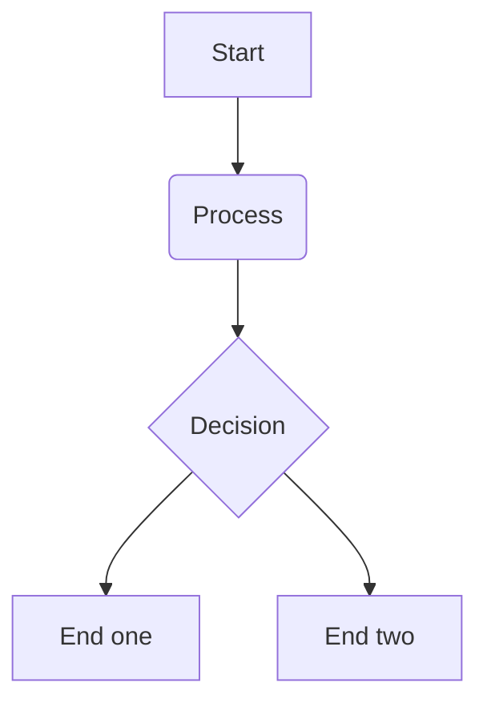

# Client Architecture

The Chefmate+ client app is a highly modularized Kotlin Multiplatform (KMP) app.

## Module Structure

The feature modules are bundled into 3 different kinds of modules to help promote separation of concerns. 

### Public Module

The `public` module is the public facing API of a feature module. Public modules are allowed to depend on other public modules and should never depend on any `impl` modules.

### Impl Module

The `impl` module is the the production implementation module, 

### Testing Module

* `testing` - 

## UI Layer

## Data Layer

## Navigation