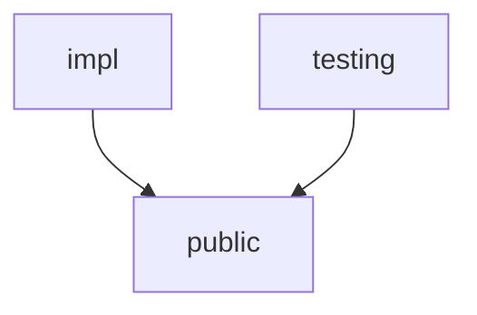

# Client Architecture

The Chefmate+ client app is a highly modularized Kotlin Multiplatform (KMP) app targeting the JVM (Desktop), Android, & iOS. The architecture is based off a business logic component (BLoC) architecture by using Decompose. l

## Module Structure

The feature modules are bundled into 3 different kinds of modules to help promote separation of concerns. 



* `public` - the public facing API of a feature module. Public modules are allowed to depend on other public modules and should never depend on any `impl` modules.
* `impl` - the production implementation of a feature module. The `impl` module can only depend on other `public` feature modules and should never depend on other feature `impl` modules. Anytime a new `impl` module is created, it should be added to the `client/composeApp/build.gradle.kts` under the `commonMain` source set so it can be registered in the dependency graph. 
* `testing` - the test implementation of a feature module. This can be used in other `impl` feature modules for testing purposes. 

## Data Layer

The data layer is abstracted in the form of a repository to mediate any data from a local cache or remote source. 

### Local Cache

The app is offline first and all data is stored in a database using sql delight. All database related code lives in the `client/database` module, so any feature module that needs to interact with the database will import that module. 

```kotlin
kotlin {
    sourceSets {
        commonMain.dependencies {
            implementation(projects.client.database)
        }
    }
}
```

### Remote Source

The remote source for all of the data is stored in supabase and can be accessed using the kotlin multiplatform sdk. 

## Business Logic Component (BLoC)

The navigation for the app is implemented using [Decompose](https://github.com/arkivanov/Decompose) which is a BLoC architecture. Every screen is represented as a BLoC, but a BLoC if needed can manage navigation between other BLoC's. 

### Simple BLoC

The simplest BLoC will represent a screen which starts with an interface. The model, any outputs, and a factory interface are nested within the BLoC interface. 

```kotlin
import com.plusmobileapps.chefmate.BlocContext
import com.plusmobileapps.chefmate.Consumer
import kotlinx.coroutines.flow.StateFlow

interface GroceryListBloc {
    // Latests BLoC state
    val state: StateFlow<Model>

    // Click listeners
    fun onGroceryItemClicked(id: String)

    // BLoC state
    data class Model(
        val items: List<GroceryItem> = emptyList(),
    )

    // Outputs
    sealed class Output {
        data class OpenDetail(
            val id: Long,
        ) : Output()
    }

    // Factory method to create the BLoC with context, output listeners, and 
    // any other assisted parameters like IDs.
    fun interface Factory {
        fun create(
            context: BlocContext,
            output: Consumer<Output>,
        ): GroceryListBloc
    }
}
```

The implementation of the BLoC interface uses the `Impl` suffix in the name. To bind the implementation to the assisted factory interface, the class is first annotated with `@Inject` followed by `@ContributesAssistedFactory` with the scope to bind it (`AppScope` is the usual scope) and the assisted factory interface. By using delegation, the `BlocContext` implementation is delegated to the assisted parameter to the class. The context gives an instance keeper and using a utility method can create a view model. 

```kotlin
import com.plusmobileapps.chefmate.BlocContext
import com.plusmobileapps.chefmate.Consumer
import com.plusmobileapps.chefmate.getViewModel
import com.plusmobileapps.chefmate.mapState
import com.plusmobileapps.kotlin.inject.anvil.extensions.assistedfactory.runtime.ContributesAssistedFactory
import kotlinx.coroutines.flow.StateFlow
import me.tatarka.inject.annotations.Assisted
import me.tatarka.inject.annotations.Inject
import software.amazon.lastmile.kotlin.inject.anvil.AppScope

@Inject
@ContributesAssistedFactory(
    scope = AppScope::class,
    assistedFactory = GroceryListBloc.Factory::class,
)
class GroceryListBlocImpl(
    @Assisted context: BlocContext,
    @Assisted private val output: Consumer<GroceryListBloc.Output>,
    viewModelFactory: () -> GroceryListViewModel,
) : GroceryListBloc,
    BlocContext by context {
    private val viewModel =
        instanceKeeper.getViewModel {
            viewModelFactory()
        }

    override val state: StateFlow<GroceryListBloc.Model> =
        viewModel.state.mapState {
            GroceryListBloc.Model(
                items = it.items,
            )
        }

    override fun onGroceryItemClicked(item: GroceryItem) {
        output.onNext(GroceryListBloc.Output.OpenDetail(item.id))
    }
}
```

The view model is where all business logic for the screen can live and will outlive configuration changes unlike the BLoC. It expects the main context to be past into the super class which can be injected with the `@Main` annotation. There is a protected property `scope` which is a coroutine scope to run any asynchronous work off of and will run work on the main thread from the main context passed in. 

```kotlin
import com.plusmobileapps.chefmate.ViewModel
import com.plusmobileapps.chefmate.di.Main
import com.plusmobileapps.chefmate.grocery.data.GroceryRepository
import kotlinx.coroutines.flow.MutableStateFlow
import kotlinx.coroutines.flow.StateFlow
import kotlinx.coroutines.flow.asStateFlow
import kotlinx.coroutines.flow.update
import kotlinx.coroutines.launch
import me.tatarka.inject.annotations.Inject
import kotlin.coroutines.CoroutineContext

@Inject
class GroceryListViewModel(
    @Main mainContext: CoroutineContext,
    private val repository: GroceryRepository,
) : ViewModel(mainContext) {
    private val _state = MutableStateFlow(State())

    val state: StateFlow<State> = _state.asStateFlow()

    init {
        scope.launch {
            repository.getGroceries().collect {
                _state.update { currentState ->
                    currentState.copy(items = it)
                }
            }
        }
    }

    data class State(
        val items: List<GroceryItem> = emptyList(),
    )
}
```

### Navigation BLoC

A BLoC that manages navigation follows a similar pattern by starting off with an interface, with a slight change exposing the router state. 

```kotlin
import com.arkivanov.decompose.router.stack.ChildStack
import com.arkivanov.decompose.value.Value
import com.arkivanov.essenty.backhandler.BackHandlerOwner
import com.plusmobileapps.chefmate.BackClickBloc
import com.plusmobileapps.chefmate.BlocContext
import com.plusmobileapps.chefmate.Consumer
import com.plusmobileapps.chefmate.recipe.core.detail.RecipeDetailBloc
import com.plusmobileapps.chefmate.recipe.core.edit.EditRecipeBloc
import kotlinx.serialization.Serializable

interface RecipeRootBloc :
    BackHandlerOwner,
    BackClickBloc {
    val routerState: Value<ChildStack<*, Child>>

    sealed class Child {
        data class Detail(
            val bloc: RecipeDetailBloc,
        ) : Child()

        data class Edit(
            val bloc: EditRecipeBloc,
        ) : Child()
    }

    sealed class Output {
        data object Finished : Output()
    }

    @Serializable
    sealed class Props {
        data class Detail(
            val recipeId: Long,
        ) : Props()

        data object Create : Props()
    }

    fun interface Factory {
        fun create(
            context: BlocContext,
            props: Props,
            output: Consumer<Output>,
        ): RecipeRootBloc
    }
}
```

The implementation BLoC creates a `StackNavigation` of the type of `Configuration` nested within the class. Then to create the router, `childStack()` takes the `StackNavigation` in as a source and provides methods for the serializer, initial stack, unique key name, and a factory method for creating the child BLoCs. 

```kotlin
import com.arkivanov.decompose.router.stack.ChildStack
import com.arkivanov.decompose.router.stack.StackNavigation
import com.arkivanov.decompose.router.stack.bringToFront
import com.arkivanov.decompose.router.stack.childStack
import com.arkivanov.decompose.router.stack.navigate
import com.arkivanov.decompose.router.stack.pop
import com.arkivanov.decompose.value.Value
import com.plusmobileapps.chefmate.BlocContext
import com.plusmobileapps.chefmate.Consumer
import com.plusmobileapps.chefmate.recipe.core.detail.RecipeDetailBloc
import com.plusmobileapps.chefmate.recipe.core.edit.EditRecipeBloc
import com.plusmobileapps.chefmate.recipe.core.root.RecipeRootBloc
import com.plusmobileapps.kotlin.inject.anvil.extensions.assistedfactory.runtime.ContributesAssistedFactory
import kotlinx.serialization.Serializable
import me.tatarka.inject.annotations.Assisted
import me.tatarka.inject.annotations.Inject
import software.amazon.lastmile.kotlin.inject.anvil.AppScope

@Inject
@ContributesAssistedFactory(
    scope = AppScope::class,
    assistedFactory = RecipeRootBloc.Factory::class,
)
class RecipeRootBlocImpl(
    @Assisted context: BlocContext,
    @Assisted private val props: RecipeRootBloc.Props,
    @Assisted private val output: Consumer<RecipeRootBloc.Output>,
    private val detailBloc: RecipeDetailBloc.Factory,
    private val editBloc: EditRecipeBloc.Factory,
) : RecipeRootBloc,
    BlocContext by context {
    private val navigation = StackNavigation<Configuration>()
    private val stack =
        childStack(
            source = navigation,
            serializer = Configuration.serializer(),
            initialStack = {
                when (props) {
                    is RecipeRootBloc.Props.Detail ->
                        listOf(
                            Configuration.Detail(recipeId = props.recipeId),
                        )
                    is RecipeRootBloc.Props.Create ->
                        listOf(
                            Configuration.Edit(recipeId = null),
                        )
                }
            },
            handleBackButton = true,
            key = "RecipeRootRouter",
            childFactory = ::createChild,
        )

    override val routerState: Value<ChildStack<*, RecipeRootBloc.Child>> = stack

    override fun onBackClicked() {
        navigation.pop()
    }

    private fun createChild(
        config: Configuration,
        context: BlocContext,
    ): RecipeRootBloc.Child =
        when (config) {
            is Configuration.Detail ->
                RecipeRootBloc.Child.Detail(
                    bloc =
                        detailBloc.create(
                            context = context,
                            recipeId = config.recipeId,
                            output = ::handleDetailOutput,
                        ),
                )
            is Configuration.Edit ->
                RecipeRootBloc.Child.Edit(
                    bloc =
                        editBloc.create(
                            context = context,
                            recipeId = config.recipeId,
                            output = ::handleEditOutput,
                        ),
                )
        }

    private fun handleEditOutput(output: EditRecipeBloc.Output) {
        when (output) {
            EditRecipeBloc.Output.Cancelled -> {
                if (props is RecipeRootBloc.Props.Create) {
                    this.output.onNext(RecipeRootBloc.Output.Finished)
                } else {
                    navigation.pop()
                }
            }
            is EditRecipeBloc.Output.Finished -> {
                navigation.navigate {
                    listOf(Configuration.Detail(output.recipeId))
                }
            }
        }
    }

    private fun handleDetailOutput(output: RecipeDetailBloc.Output) {
        when (output) {
            RecipeDetailBloc.Output.Finished -> {
                this.output.onNext(RecipeRootBloc.Output.Finished)
            }
            is RecipeDetailBloc.Output.EditRecipe -> {
                navigation.bringToFront(
                    Configuration.Edit(recipeId = output.recipeId),
                )
            }
        }
    }

    @Serializable
    sealed class Configuration {
        data class Detail(
            val recipeId: Long,
        ) : Configuration()

        data class Edit(
            val recipeId: Long?,
        ) : Configuration()
    }
}
```

## UI Layer

All UI is written using Compose Multiplatform to share the same UI across all of the client targets. Every UI has the suffix `Screen` to the name of its file, i.e. `RecipeListScreen.kt`. These files live in the feature's `public` module so that it could be bound into which ever feature depends on it.

All reusable components for the project exist in `client/ui/public` module typically prefixing every component with `Plus`. `PlusHeaderContainer` is the most common component used at the base of every screen's `@Composable`.

### Localized Strings

All strings are localized using Compose Multiplatform resources. To localize strings in a given feature module, import the following dependency in the feature module `build.gradle.kts`: 

```kotlin
plugins {
    alias(libs.plugins.compose)
}

kotlin {
    sourceSets {
        commonMain.dependencies {
            implementation(compose.components.resources)
        }
    }
}
```

Then create a file within `client/<feature-module>/src/commonMain/composeResources/values/strings.xml`. 

```xml
<resources>
    <string name="recipe_list_title">Recipes</string>
</resources>
```

The app needs to be rebuilt to generate the strings, but should be accessible like so: 

```kotlin
import chefmate.client.recipe.list.public.generated.resources.Res
import chefmate.client.recipe.list.public.generated.resources.recipe_list_title

@Composable
fun RecipeListScreen() {
    Text(stringResource(Res.string.recipe_list_title))  
}
```

### TextData

To promote a better separation of concerns, there is a sealed class called `TextData` which can represent a fixed string, resource string, quantity string, or a formatted string called a phrase model. This allows for the domain model from a viewmodel to be mapped to the UI model within the Bloc. Then the UI is able to evaluate the `TextData` to a string within compose code using the `localized()` function.

```kotlin
sealed class TextData {
    @Composable
    abstract fun localized(): String
}
```

Since all UI lives in the `public` modules, the text module should be exposed with `api` in the public module so that it can be accessible from the impl module. 

```kotlin
kotlin {
    sourceSets {
        commonMain.dependencies {
            api(projects.client.text.public)
        }
    }
}
```

#### Fixed String

`FixedString` is just a raw string. This is typically used when given a response back from an API or to create a composable preview for a screen that has `TextData` in its model. 

```kotlin
import com.plusmobileapps.chefmate.text.FixedString

@Preview
@Composable
fun GroceryListPreview() {
    ChefMateTheme {
        SettingsScreen(
            title = FixedString("Grocery List")
        )
    }
}
```

#### Resource String

A `ResourceString` is just a localized string resource that was made using compose multiplatform resources.

```kotlin
ResourceString(Res.string.grocery_list_title)
```

#### Phrase Model

A `PhraseModel` is a resource string with phrases that you can format arguments into a word surrounded by curly braces. An example phrase model string resource would look like: 

```xml
<resources>
    <string name="greeting">Hello {first_name} {last_name}!</string>
</resources>
```

To create a phrase model string, pass in the string resource and a pair mapping the key to the value which is another `TextData`. 

```kotlin
PhraseModel(
    resource = Res.string.greeting,
    "first_name" to FixedString("Darth"),
    "last_name" to FixedString("Vader")
)
```