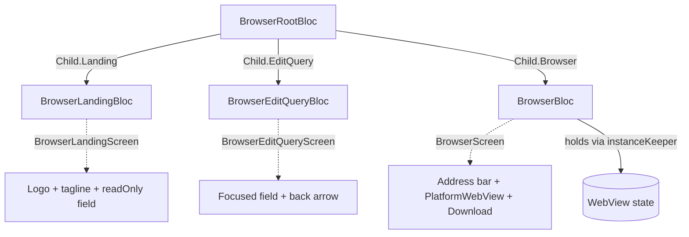
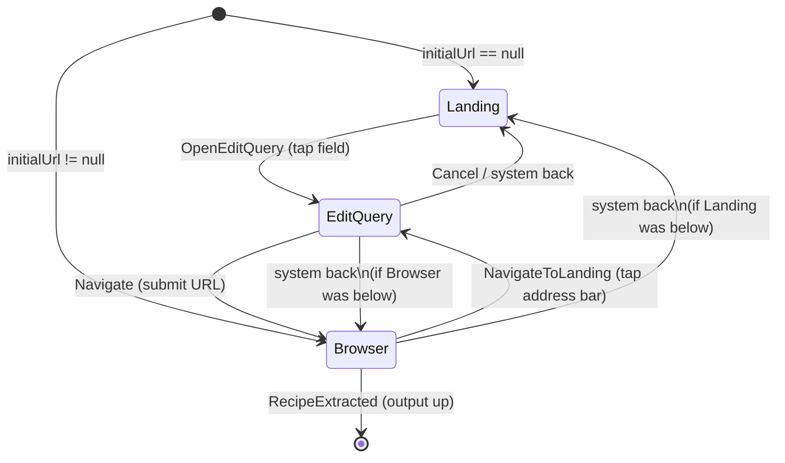
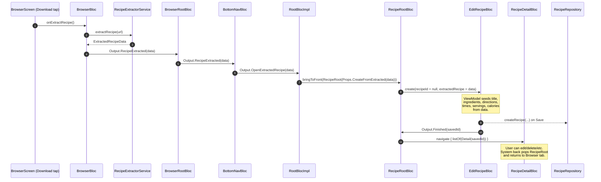
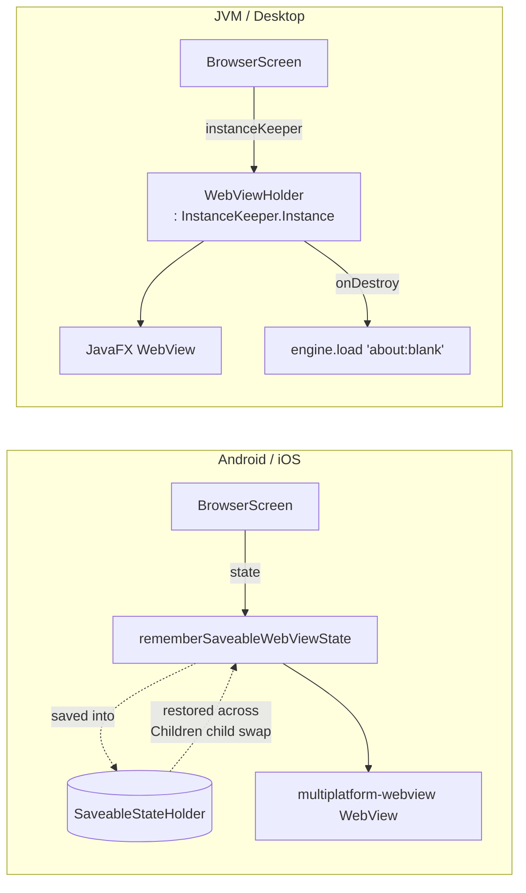
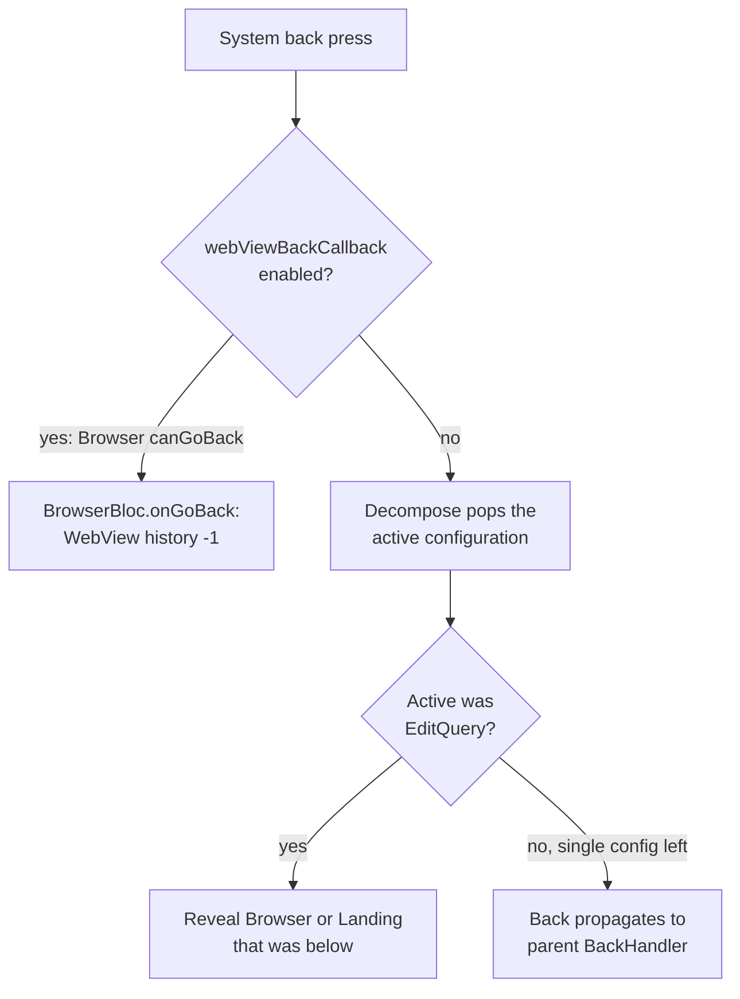

# Browser Architecture

The browser tab lets the user search the web, navigate to a recipe page, and import it into the app's library by editing the extracted fields before saving. It is composed of three BLoCs under a navigation root, plus a platform-specific WebView. This document covers the BLoC layout, the navigation stack, the recipe-extraction flow up to `RecipeRoot`, WebView state preservation, and back-button handling.

For the general BLoC pattern (interface + impl + view-model, factories, scopes), see [`architecture.md`](architecture.md).

## BLoC layout

`BrowserRootBloc` owns a Decompose `ChildStack` of three configurations. Each child is a separate BLoC with its own screen. All three screens place their search field under the same `sharedElement` key (`"browser-address-bar"`) so the field animates between them via `SharedTransitionLayout` + `AnimatedContent`.

| BLoC | Purpose | Responsibilities |
|---|---|---|
| `BrowserRootBloc` | Navigation root | Owns the `ChildStack`. Receives `BrowserBloc.Output.RecipeExtracted` and forwards it to its parent. Hosts the `BackCallback` that drives the WebView back button. Exposes `navigateToUrl(url)` for shared-URL handling from the bottom nav. |
| `BrowserLandingBloc` | New-tab home | Stateless. Tapping the read-only field emits `Output.OpenEditQuery`; the EditQuery screen is what actually accepts input and submits. |
| `BrowserEditQueryBloc` | URL/search editor | Same URL/search heuristic as Landing (see `toNavigationUrl`). On submit emits `Output.Navigate(url)`; the back arrow emits `Output.Cancel`. |
| `BrowserBloc` | WebView screen | Tracks `currentUrl`, `webViewReportedUrl`, `addressBarText`, and `canGoBack/canGoForward` reported by the WebView. Tapping the address bar emits `Output.NavigateToLanding(currentText)`. The Download button calls `extractRecipe()` which extracts via `RecipeExtractorService` and emits `Output.RecipeExtracted(extracted)` — it does **not** save to the repo. |

## Navigation state machine

`BrowserRootBlocImpl` manages a `StackNavigation<Configuration>` with three serializable configurations: `Landing` (object), `EditQuery(initialText)`, and `Browser(url)`. Decompose enforces uniqueness of configurations within a stack, so two of the navigation transitions go through dedupe helpers (`replaceTopEditQueryWith`, `replaceEditQueryWithBrowser`).

### Transitions in code

| Trigger | Origin | Implementation | Notes |
|---|---|---|---|
| Initial child | constructor | `if (initialUrl != null) listOf(Browser(initialUrl)) else listOf(Landing())` | Recipe-detail "open source URL" provides `initialUrl`. |
| `BrowserLandingBloc.Output.OpenEditQuery` | tap landing field | `replaceTopEditQueryWith(EditQuery(""))` | Drops any pre-existing `EditQuery` to avoid duplicate-config crash. The Landing field is read-only so the seed is always empty. |
| `BrowserEditQueryBloc.Output.Navigate` | submit URL | `replaceEditQueryWithBrowser(Browser(url))` | Drops the EditQuery on top **and** any existing same-URL Browser before adding the new Browser. |
| `BrowserEditQueryBloc.Output.Cancel` | back arrow | `navigation.pop()` | Returns to whatever was below the EditQuery. |
| `BrowserBloc.Output.NavigateToLanding` | tap address bar | `replaceTopEditQueryWith(EditQuery(text))` | Same dedupe as Landing's path. |
| `BrowserBloc.Output.RecipeExtracted` | tap Download | forwarded as `BrowserRootBloc.Output.RecipeExtracted(extracted)` | Stack is unchanged; the parent (`BottomNavBlocImpl`/`RootBlocImpl`) is what opens the recipe-edit modal. |

## Recipe extraction flow

When a recipe is extracted, the data — represented as a `@Serializable` `ExtractedRecipeData` in `recipe/data/public` — flows up through four BLoCs and lands in the recipe edit screen pre-populated. The user reviews, edits, and explicitly saves; on save they go to the recipe detail. Pressing back from the detail returns to the browser tab because the entire `RecipeRoot` was pushed onto `RootBloc` *above* the bottom nav.

### Data shape

`ExtractedRecipeData` carries only the fields that come out of the schema.org/JSON-LD parser, with no `id`, timestamps, or `syncStatus`. It lives in `client/recipe/data/public` so both the browser and recipe modules can depend on it without a feature-cross-feature dependency, and `kotlinx.serialization` handles it as a `Configuration`/`Props` payload across process death.

## Platform WebView state preservation

Switching tabs (and pushing the recipe-edit modal) removes `BrowserScreen` from composition. Without state preservation, the underlying WebView is destroyed and history is lost. The fix differs per platform.

| Platform | Mechanism | Where |
|---|---|---|
| Android, iOS | `rememberSaveableWebViewState` from `compose-webview-multiplatform`. The library's `WebStateSaver` snapshots the WebView state Bundle (URL, history, scroll, page title) into Compose's `SaveableStateHolder`, which Decompose's `Children` retains across child-stack swaps. `lastCommandedUrl` is also `rememberSaveable` so reentry doesn't reload and clobber history. | `PlatformWebView.android.kt`, `PlatformWebView.ios.kt` |
| JVM | The actual JavaFX `WebView` is owned by a `WebViewHolder : InstanceKeeper.Instance` retrieved via `instanceKeeper.getOrCreate {}`, so the same WebView (with its history) survives composition exit/entry as long as the bloc is alive. | `PlatformWebView.jvm.kt` |

JVM also wires the standard 5-button mouse: an `addEventFilter(MOUSE_PRESSED)` on the JavaFX `WebView` maps `MouseButton.BACK`/`MouseButton.FORWARD` to `goBack()`/`goForward()`.

## Back handling

`BrowserRootBlocImpl` enables a `BackCallback` that intercepts the system back press *only* when the active child is a `Browser` and its `canGoBack` is true. Otherwise, Decompose's normal stack handling pops the top configuration.

The callback's `isEnabled` is driven by a `lifecycle.doOnResume`/`doOnPause` pair (mirroring `BottomNavBlocImpl.observeRouter`). On resume it subscribes to the `ChildStack` and, when the active child is `Browser`, launches a coroutine on `createScope()` that mirrors the bloc's `state.canGoBack` into `webViewBackCallback.isEnabled`. On pause it cancels both the subscription and the inner job and disables the callback.

## Where to look

| Concern | Path |
|---|---|
| Public BLoC + screen contracts | `client/browser/public/src/commonMain/kotlin/com/plusmobileapps/chefmate/browser/` |
| Navigation root + dedupe helpers | `BrowserRootBlocImpl.kt` (impl) |
| URL/search heuristic | `NavigationUrl.kt` (`toNavigationUrl`) |
| Extraction parser | `RecipeExtractorService.kt` |
| Cross-feature data class | `client/recipe/data/public/.../ExtractedRecipeData.kt` |
| Edit-with-extracted-seed wiring | `RecipeRootBloc.Props.CreateFromExtracted`, `EditRecipeBloc.Factory.create(..., extractedRecipe = ...)`, `EditRecipeViewModel.init` |
| Tests covering the dedupe regression | `BrowserRootBlocImplTest` (`When_edit_query_pushed_while_one_already_in_back_stack_Then_no_duplicate_crash`, `When_edit_query_navigate_with_same_url_as_existing_browser_Then_no_duplicate_crash`) |
