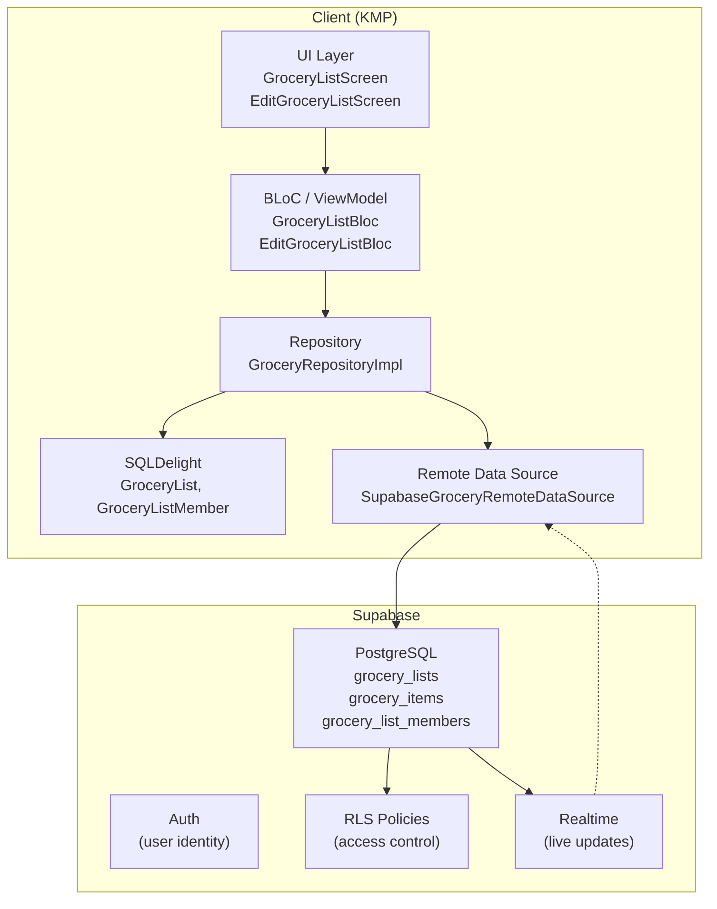
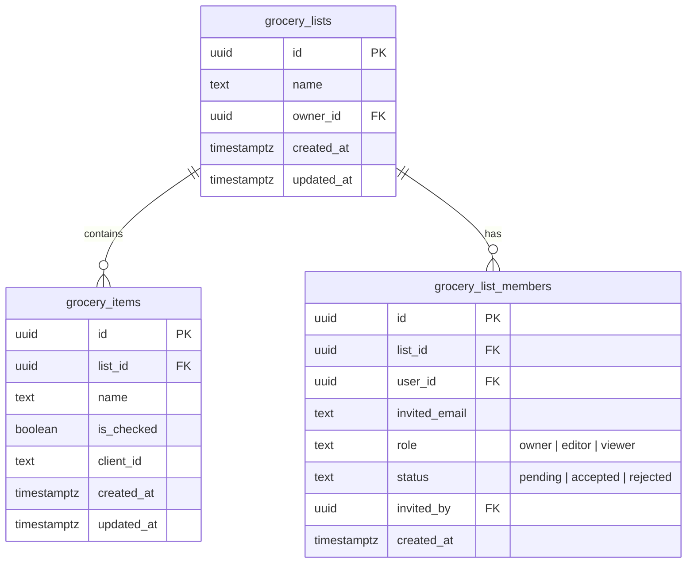
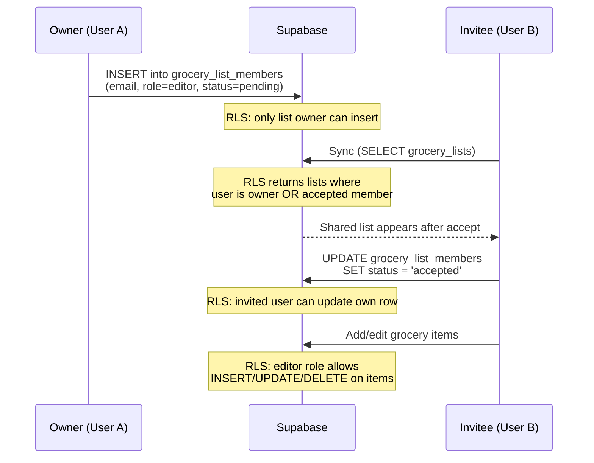

# Collaboration

Chef Mate has three sharing scopes, which coexist rather than replacing one another:

| Scope | Grants access to | Roles | Where it lives |
|---|---|---|---|
| **Grocery list** | one list and its items | owner / editor / viewer | `grocery_list_members` — the bulk of this document |
| **Recipe book** | one book and its recipes | owner / editor / viewer | `recipe_book_members` — see the `recipebook` modules |
| **Family** | many grocery lists, many recipe books, and one meal plan | owner / member | `families` + `family_members` — see [Family](#family) |

A user may belong to at most one family, and a family sits *alongside* per-entity sharing: you can
still share a single list or book with someone outside your family.

## Grocery list collaboration

Everything from here to [Family](#family) describes the grocery-list scope. It came first and is
the most complete implementation — realtime, a local member cache, permission gating — so it's the
template the other scopes follow.

Collaboration lets a user share a grocery list with others by email. Each list has role-based
access control (Owner, Editor, Viewer) enforced at both the UI and database levels via Supabase
Row Level Security (RLS).



## Roles

| Role | Grocery Lists |
|------|--------------|
| **Owner** | Full control: rename, delete list, manage items, invite/remove collaborators |
| **Editor** | Add, check, delete items. Cannot rename or delete the list |
| **Viewer** | Read-only. Cannot add, check, or delete items |

## Data Model

### Supabase Tables



### Local SQLDelight Schema

The local database mirrors the remote collaboration state with these additions:

**GroceryList** (new columns):
- `ownerId` - remote user ID of the list owner
- `role` - current user's role (`owner`, `editor`, `viewer`)
- `isShared` - whether this list was shared by another user

**GroceryListMember** (new table): local cache of collaborators per list.

## Invitation Flow



For users who don't have an account yet, the `invited_email` is stored with `user_id = NULL`. A
database trigger on `auth.users` INSERT automatically migrates pending invitations when the user
signs up.

### Email notification on invite

An invitee is emailed out-of-band when they're invited, so they don't have to already be in the
app to discover a pending invite. Because every client inserts the invite directly into the member
table, this is done entirely on the backend and requires no app-side code:

- An `AFTER INSERT` trigger on `grocery_list_members` (and `recipe_book_members`) calls
  `notify_invite_email()`, which fires `pg_net` at the `send-invite-email` edge function for each
  new `status='pending'` row. `net.http_post` is async, so a slow or failing email never blocks or
  rolls back the invite insert.
- The edge function resolves the list/book name and the inviter's display name with the
  service-role client and sends the mail via Resend.
- **Re-invites don't re-email**: the `UNIQUE(list_id, invited_email)` constraint makes a repeat
  invite an UPDATE, not an INSERT, so the trigger doesn't fire.

**Setup:** deploy the function (`supabase functions deploy send-invite-email`), set its secrets
(`RESEND_API_KEY`, `INVITE_HOOK_SECRET`; `SUPABASE_URL` / `SUPABASE_SERVICE_ROLE_KEY` are
auto-injected), verify the Resend sending domain, and store two Vault secrets the trigger reads —
`project_url` and `invite_hook_secret` (the latter matching `INVITE_HOOK_SECRET`). Vault secrets go
through the Dashboard's SQL Editor, not the CLI. See the header of
`supabase/migrations/20260707_invite_email_notification.sql` for the exact `vault.create_secret`
calls, how to verify they landed, and how to rotate `invite_hook_secret` (via `vault.update_secret`
— `create_secret` errors on a duplicate name).

The verified sending domain is `plusmobileapps.com` and the default sender is
`noreply@plusmobileapps.com` (see `DEFAULT_FROM` in the edge function; override at runtime with the
`RESEND_FROM` secret). Resend authorizes any address at that exact domain — a subdomain such as
`chefmate.plusmobileapps.com` would need separate verification.

## Sync Strategy

The existing offline-first sync is extended for collaboration:

1. **Push phase** (owned lists only):
   - Push unsynced/dirty lists where `role = 'owner'`
   - Shared lists are never pushed as new creations

2. **Pull phase** (all accessible lists):
   - `fetchAccessibleGroceryLists()` uses a filter-less SELECT — RLS returns owned + shared lists
   - Each pulled list is tagged locally with `ownerId`, `role`, and `isShared`
   - Members are fetched and cached in `GroceryListMember`

3. **Item sync** (unchanged): items sync per-list; RLS authorizes shared-list items.

## RLS Policy Summary

| Table | SELECT | INSERT | UPDATE | DELETE |
|-------|--------|--------|--------|--------|
| `grocery_lists` | owner OR accepted member | owner only | owner OR editor member | owner only |
| `grocery_items` | user has list access | owner OR editor | owner OR editor | owner OR editor |
| `grocery_list_members` | list members + owner | list owner only | invited user OR owner | owner OR self (leave) |

## UI Components

- **List selector** (responsive): a bottom-sheet modal on phones, an anchored dropdown on
  tablets/desktop. Split into "My Lists" and "Shared with me"; shared lists show a badge. Each row
  has an edit (pencil) icon that opens the Edit Grocery List screen.
- **Edit Grocery List screen** (full screen): rename the list, delete it behind a confirmation
  dialog (owner only), and manage collaboration. Collaboration is auth-gated — signed-out users
  see a message with Sign in / Sign up; authenticated owners invite by email and remove
  collaborators.
- **Permission gating**: viewers don't see the add-item input.

### Key Files

| Concern | Path |
|---------|------|
| Supabase migration | `supabase/migrations/20260425_add_collaboration.sql` |
| Invite-email migration | `supabase/migrations/20260707_invite_email_notification.sql` |
| Invite-email edge function | `supabase/functions/send-invite-email/index.ts` |
| SQLDelight migration | `client/database/core/src/commonMain/sqldelight/.../database/6.sqm` |
| Member queries | `client/database/core/src/commonMain/sqldelight/.../GroceryListMember.sq` |
| Collaboration models | `client/grocery/data/public/.../CollaborationModels.kt` |
| Remote member model | `client/grocery/data/impl/.../remote/RemoteGroceryListMember.kt` |
| Repository | `client/grocery/data/impl/.../GroceryRepositoryImpl.kt` |
| List BLoC | `client/grocery/core/public/.../list/GroceryListBloc.kt` |
| Edit BLoC | `client/grocery/core/public/.../edit/EditGroceryListBloc.kt` |
| Edit screen | `client/grocery/core/impl/.../edit/ui/EditGroceryListScreen.kt` |
| DI bindings | `client/database/core/.../di/DatabaseComponent.kt` |

---

## Family

A **family** is a group of accounts that share content across all three domains at once: many
grocery lists, many recipe books, and a single meal plan. It exists so meal planning can be shared
without bolting a third per-entity member table onto `meal_plans`.

It's reachable from one row on the More tab, below Notifications and behind the same gate — a
family is keyed on account emails, so it's hidden for signed-out and anonymous users.

### Phasing

Phase 1 (shipped) is the group and its invite flow only. The `family_id` columns that actually
scope the three domains land in later phases:

- **Phase 2** — `family_id` on `grocery_lists` and `recipe_books`, plus a "Share with family"
  toggle. No new policies: the existing `can_access_*` / `can_edit_*` helpers gain an
  `OR family_id = current_family_id()` clause and every policy already delegates to them.
- **Phase 3** — `family_id` on `meal_plans`, realtime for the shared calendar, and auto-sharing a
  scheduled recipe into the family's recipe book so every member can actually open it.

### Roles

| Role | Can |
|---|---|
| **Owner** | Everything a member can, plus invite, remove members, rename, and delete the family |
| **Member** | Read and edit everything shared with the family |

Only two roles, unlike the other scopes' three. A family implies trust — the distinction that
matters is who administers the group, not who may edit.

### One family per user

Enforced by the database, not the client:

```sql
CREATE UNIQUE INDEX idx_fm_one_accepted_family_per_user
  ON family_members (user_id)
  WHERE status = 'accepted' AND user_id IS NOT NULL;
```

Any number of *pending* invites are fine; accepting a second one fails with SQLSTATE 23505. The
repository translates that into `AlreadyInFamilyException`, and the UI tells the user to leave their
current family first. `current_family_id()` can therefore return a single unambiguous value, which
is what every Phase 2/3 policy compares against.

### Reads are cached, writes are remote-first

Unlike `GroceryList` / `RecipeBook`, the local `Family` and `FamilyMember` tables carry no
`clientId` / `isDirty` / `getUnsynced` columns — they're read caches, not offline-first sync
targets. Membership is inherently a server concept: creating a family offline could collide with an
invite accepted on another device, and the one-family rule can only be arbitrated by the database.
So mutations go remote-first and throw, while reads come off the cache and render offline.

The middle ground matters: grocery caches its members locally and can expose a `Flow`, while
recipe-book collaboration went remote-only and can only offer one-shot `suspend` reads. Family
follows grocery.

### `current_family()`, not `SELECT * FROM families`

The `families_invitees_select` policy deliberately lets a *pending* invitee read the family row they
were invited to, so the invite card can show its name. A blanket `select()` would therefore pull an
unjoined family into the local cache — the same over-fetch shape as issue #487. The client goes
through the `current_family()` RPC instead, which filters on `current_family_id()`.

### Invites

Identical mechanism to the other two scopes, so nothing new was needed end to end: the owner
inserts a `family_members` row, an `AFTER INSERT` trigger fires the same `notify_invite_email()`
function (extended with a `family` kind), and the invitee sees it in the in-app Notifications list
as `AppNotification.FamilyInvite`. There is **no invite deep link** — the email points at
`/notifications`, which the app already handles, so this needed no new Android `pathPrefix` and no
AASA change in the `chefmate-site` repo.

### Family key files

| Concern | Path |
|---------|------|
| Supabase migration | `supabase/migrations/20260813_add_families.sql` |
| SQLDelight migration | `client/database/core/src/commonMain/sqldelight/.../database/11.sqm` |
| Local tables | `client/database/core/src/commonMain/sqldelight/.../Family.sq`, `FamilyMember.sq` |
| Repository contract | `client/family/data/public/.../FamilyRepository.kt` |
| Repository | `client/family/data/impl/.../FamilyRepositoryImpl.kt` |
| Remote data source | `client/family/data/impl/.../remote/SupabaseFamilyRemoteDataSource.kt` |
| BLoC | `client/family/core/public/.../FamilyBloc.kt` |
| Screen | `client/family/core/public/.../ui/FamilyScreen.kt` |
| Notification kind | `client/notifications/data/public/.../AppNotification.kt` |
| Settings row | `client/settings/public/.../ui/SettingsScreen.kt` |
