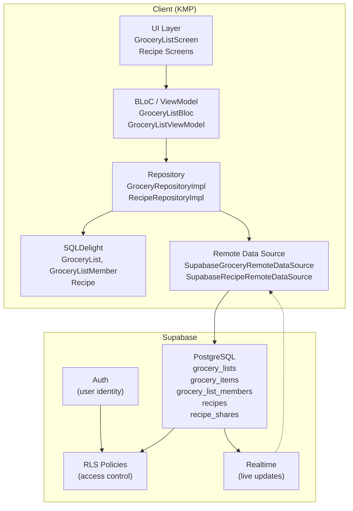
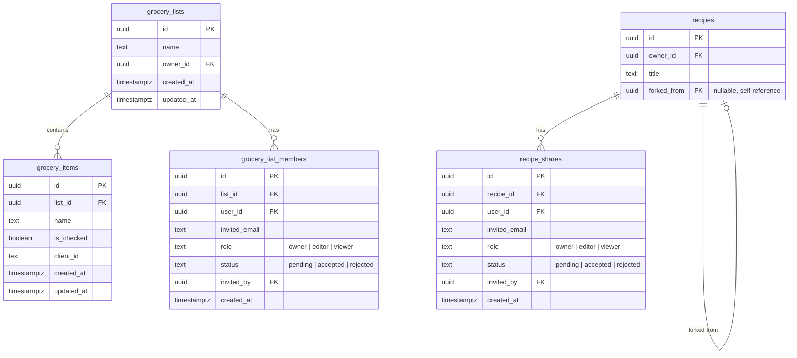
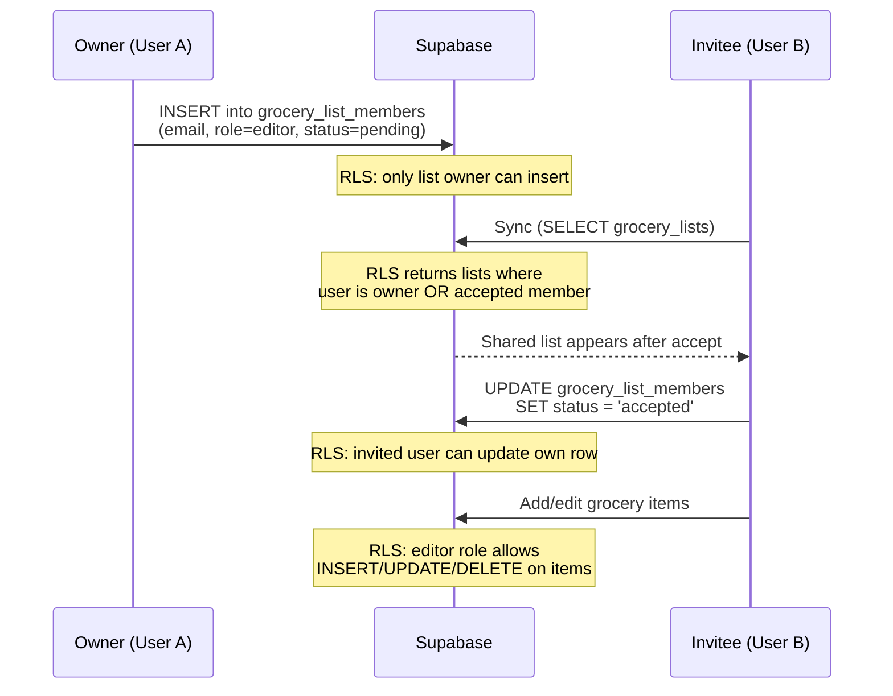

# Collaboration Architecture

This document describes the architecture for grocery list and recipe collaboration in Chef Mate.

## Overview

Collaboration allows users to share grocery lists and recipes with others via email invitations. Each shared resource has role-based access control (Owner, Editor, Viewer) enforced at both the UI and database levels via Supabase Row Level Security (RLS).

## Roles

| Role | Grocery Lists | Recipes |
|------|--------------|---------|
| **Owner** | Full control: rename, delete list, manage items, invite/remove collaborators | Full control: edit, delete, share |
| **Editor** | Add, check, delete items. Cannot rename or delete the list | Edit recipe. Cannot delete |
| **Viewer** | Read-only. Cannot add, check, or delete items | Read-only. Can fork (copy) to own account |

## Data Model

### Supabase Tables

### Local SQLDelight Schema

The local database mirrors the remote collaboration state with these additions to existing tables:

**GroceryList** (new columns):
- `ownerId` - remote user ID of the list owner
- `role` - current user's role (`owner`, `editor`, `viewer`)
- `isShared` - whether this list was shared by another user

**GroceryListMember** (new table): local cache of collaborators per list.

**Recipe** (new columns):
- `forkedFromRemoteId` - remote ID of the original recipe (if forked)
- `forkedFromTitle` - title of the original recipe
- `role` / `isShared` - same as grocery lists

## Invitation Flow

For users who don't have an account yet, the `invited_email` is stored with `user_id = NULL`. A database trigger on `auth.users` INSERT automatically migrates pending invitations when the user signs up.

## Sync Strategy

The existing offline-first sync is extended for collaboration:

1. **Push phase** (owned lists only):
   - Push unsynced lists where `role = 'owner'`
   - Push dirty lists where `role = 'owner'`
   - Shared lists are never pushed as new creations

2. **Pull phase** (all accessible lists):
   - `fetchAccessibleGroceryLists()` uses a filter-less SELECT — RLS returns owned + shared lists
   - Each pulled list is tagged locally with `ownerId`, `role`, and `isShared`
   - Members are fetched and cached in `GroceryListMember` table

3. **Item sync** (unchanged):
   - Items sync per-list as before
   - RLS handles authorization for shared list items

## Recipe Forking

When a viewer or editor copies a shared recipe:

1. A new recipe is created in the user's account with identical content
2. `forked_from` is set to the original recipe's remote ID
3. The local record stores `forkedFromRemoteId` and `forkedFromTitle`
4. The UI displays "Forked from: [original title]" on the recipe detail screen

The fork is a full copy — changes to the original do not propagate.

## RLS Policy Summary

All access control is enforced server-side via Supabase RLS:

| Table | SELECT | INSERT | UPDATE | DELETE |
|-------|--------|--------|--------|--------|
| `grocery_lists` | owner OR accepted member | owner only | owner OR editor member | owner only |
| `grocery_items` | user has list access | owner OR editor | owner OR editor | owner OR editor |
| `grocery_list_members` | list members + owner | list owner only | invited user OR owner | owner OR self (leave) |
| `recipes` | owner OR accepted share | owner only | owner OR editor share | owner only |
| `recipe_shares` | recipe members + owner | recipe owner only | invited user OR owner | owner OR self |

## UI Components

### Grocery List Screen

- **Share button** (top app bar): visible only to list owners. Opens the collaborator management sheet.
- **Collaborator sheet**: shows current members with role/status, email invite input field.
- **List selector**: split into "My Lists" and "Shared with me" sections. Shared lists show a badge.
- **Permission gating**: viewers don't see the add-item input or delete buttons.

### Key Files

| Concern | Path |
|---------|------|
| Supabase migration | `supabase/migrations/20260425_add_collaboration.sql` |
| SQLDelight migration | `client/database/src/commonMain/sqldelight/migrations/4.sqm` |
| Member queries | `client/database/src/commonMain/sqldelight/.../GroceryListMember.sq` |
| Collaboration models | `client/grocery/data/public/.../CollaborationModels.kt` |
| Remote member model | `client/grocery/data/impl/.../remote/RemoteGroceryListMember.kt` |
| Repository (grocery) | `client/grocery/data/impl/.../GroceryRepositoryImpl.kt` |
| Repository (recipe) | `client/recipe/data/impl/.../RecipeRepositoryImpl.kt` |
| BLoC interface | `client/grocery/core/public/.../list/GroceryListBloc.kt` |
| ViewModel | `client/grocery/core/impl/.../list/GroceryListViewModel.kt` |
| UI screen | `client/grocery/core/public/.../list/GroceryListScreen.kt` |
| DI bindings | `client/database/.../di/DatabaseComponent.kt` |
